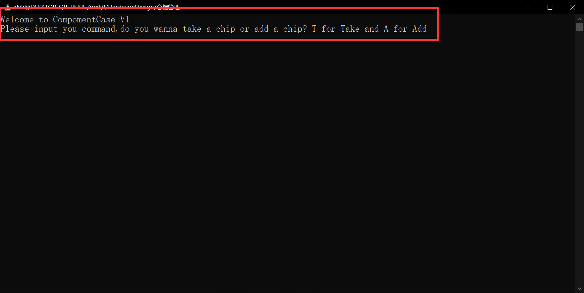
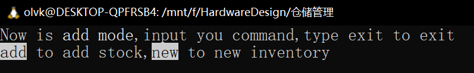
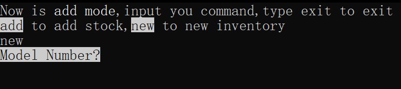
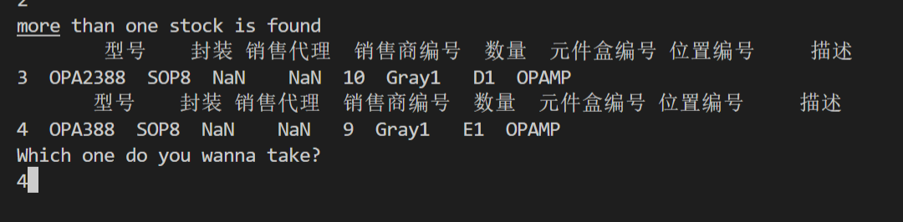

# CompomentCase V1 用户指南
## 项目介绍
ComponentCase V1是一种基于Python与命令行UI的个人或小型团队的仓储管理系统。与常见的ERP系统相比，ComponentCase有着系统轻量化，占用资源小，布设简单等优势。但是同样存在对大规模系统管理无力，无GUI界面等缺点。
## 软件安装
ComponentCase V1基于Python运行，本质上是直接使用源码运行的脚本文件。所需的依赖环境为：
- Python3
- Pandas

为了更好的应用体验，推荐安装
- Excel
- LibreOffice

或其他用于xlsx文件浏览编辑的软件。
### 安装过程
将系统解压到文件夹当中，根据自己的需要建立xlsx文件。样例的xlsx文件请参照InCase.xlsx文件。
之后启动任意命令行，在命令行当中运行：
```cmd
python3 UI.py
```
即可开始使用本系统
## 软件使用
### 新增库存
新增库存特指从外部购买到了需要的IC，在元件盒当中开辟一个新的元件格，并将其放置到其中的过程。
对于新增库存，首先启动系统，系统会显示如下内容

对于新增库存，我们需要选择add a chip，因此输入a或add或A
之后系统进入add模式

对于新增库存，我们选择new命令

可以看到，进入到一个交互式的输入界面，将型号，数量，代理商等信息依次输入进去。对于不需要指定经销商的情况，可以在```Sale?```是直接输入回车跳过。
在完成一次新增之后，会重新回到new的指令界面。此时输入```exit```可以退出new的状态
### 填补库存
填补库存是在库存消耗之后，购买新的片子补上库存的过程。
对于填补库存，请按照如下流程进行
1. 启动系统
2. 输入add进入add模式
3. 输入add指令进入add状态
4. 输入需要填补的型号和数量。
5. 如果系统检测到之前并没用这个片子则会提示使用new指令新建库存。如果系统检测到有多个库存，则会显示多个分类。此时可以使用最前面的index数据去选择放到哪个库存当中
6. 填补库存完成

对于多个库存的选择，如下图所示


### 芯片查询
对于查询芯片，是在调用芯片的前一步，额可以用于库存的查询。
流程如下
1. 启动系统
2. 输入take进入take模式
3. 输入where进行芯片查询
4. 输入想要查询的芯片型号
5. 系统返回芯片的位置，如果没有的话亦会提示
6. 完成所有芯片的查询之后，输入exit推出查询

### 芯片出库
对于芯片出库，是芯片取用的过程。
流程如下
1. 启动系统
2. 输入take进入take模式
3. 输入take进行芯片查询
4. 输入想要取用的芯片型号与数量
5. 系统返回芯片的位置，如果没有的话亦会提示
6. 完成所有芯片的查询之后，输入exit推出查询